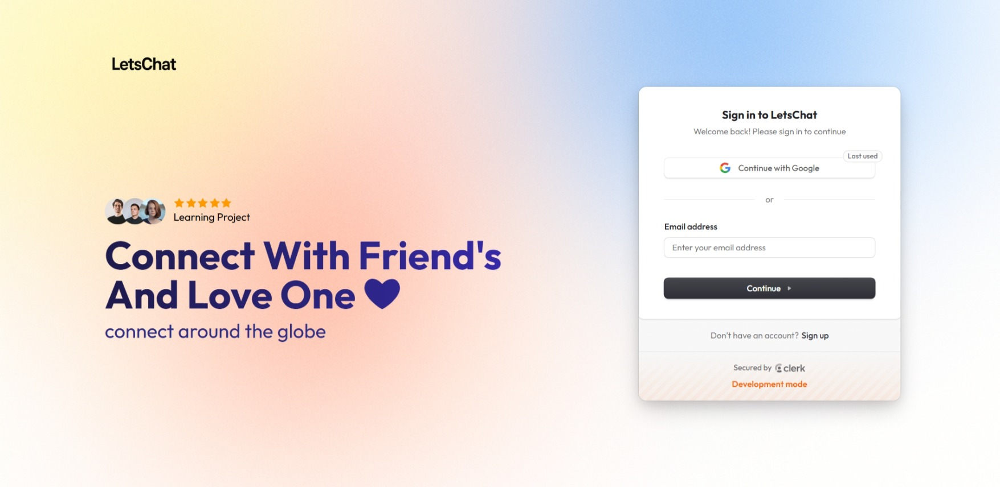
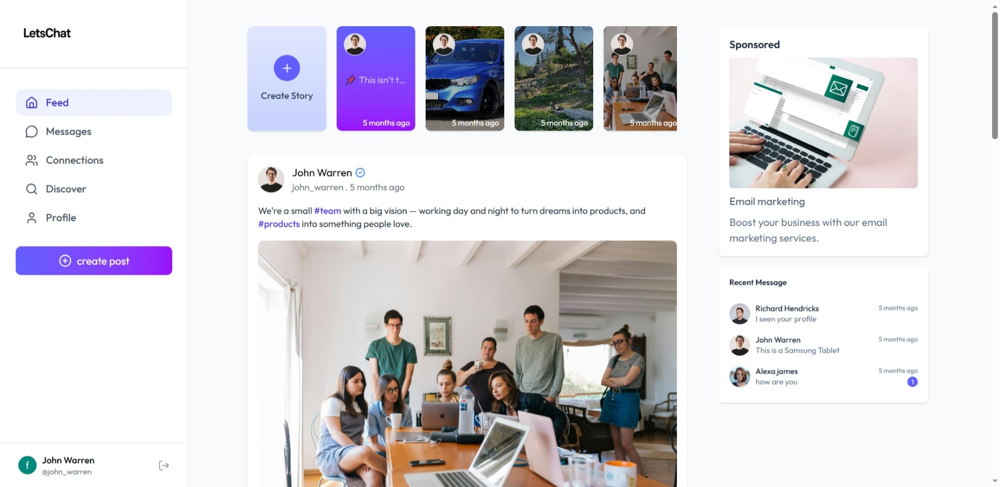
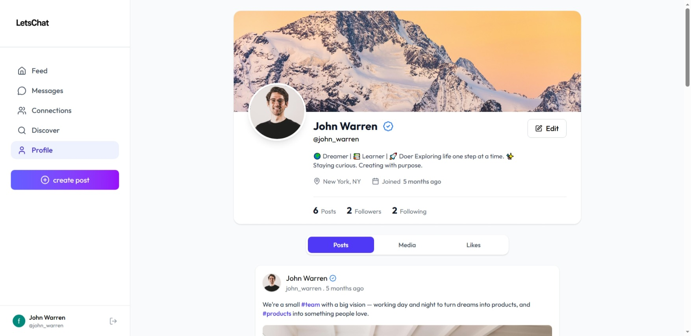
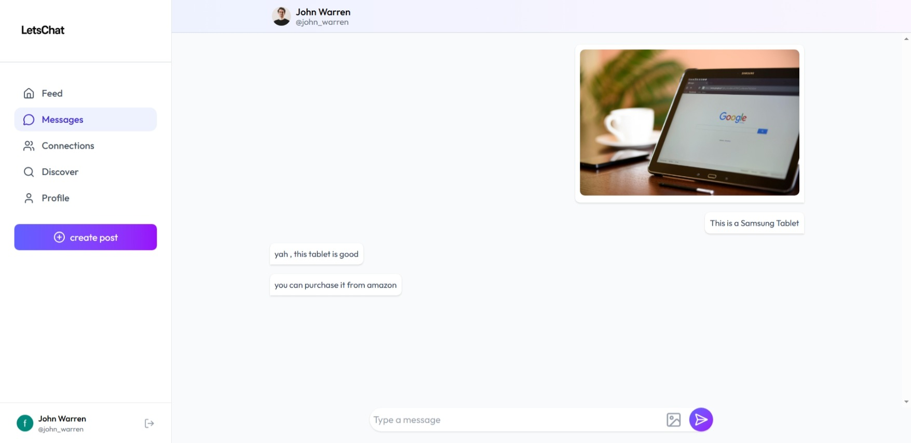

# LetsChat – Social Media Web Application

A modern, full-featured social media web application built with **React**.  
LetsChat enables users to create posts, share stories, send messages, follow connections, and interact in real time.  
Authentication is powered by **Clerk**, UI by **TailwindCSS**, icons by **Lucide-React**, and timestamps by **Moment.js**.

---

## Live Demo

Check out the live demo of LetsChat: [LetsChat](https://lets-chat-alpha.vercel.app/)

## 📸 Screenshots

### Login / Signup  


### Home Feed


### User Profile  


### Chat Interface  


---

## ✨ Features

### **Authentication**
- Secure login and signup using Clerk Authentication.
- Token-based session management.
- Automatic user state handling.

### **Posts**
- Create **photo** or **text** posts.
- Like, comment, share.
- Real-time updates on feed.

### **Stories**
- Upload **photo**, **video**, or **text** stories.
- Auto-expiring story system.
- Story Viewer with swipe/slide navigation.

### **Messaging**
- One-to-one **real-time chat**.
- Live user status (online/offline).
- Typing indicators (optional depending on your implementation).

### **Connections**
- Send/receive connection requests.
- Follow/unfollow users.
- Manage followers & following.

### **Profiles**
- Update profile info (bio, avatar, etc.).
- View posts, followers, and following.
- Personalized profile display.

### **User Experience**
- Fully responsive UI using TailwindCSS.
- Human-readable timestamps using Moment.js.
- Modern icon system with Lucide-React.

---

## 🛠️ Tech Stack

### **Frontend**
- React.js
- Vite
- TailwindCSS
- Lucide-React (icons)
- Moment.js
- Clerk Authentication

### **State Management**
- React Hooks
- Context API for global state

---

## 📁 Folder Structure

📂 src
│
├── 📁 assets
│
├── 📁 components
│ ├── 📄 Loading.jsx
│ ├── 📄 MenuItem.jsx
│ ├── 📄 PostCard.jsx
│ ├── 📄 ProfileModel.jsx
│ ├── 📄 RecentMessages.jsx
│ ├── 📄 Sidebar.jsx
│ ├── 📄 StoryBar.jsx
│ ├── 📄 StoryModel.jsx
│ ├── 📄 StoryViewer.jsx
│ ├── 📄 UserCard.jsx
│ └── 📄 UserProfileInfo.jsx
│
├── 📁 pages
│ ├── 📄 ChatBox.jsx
│ ├── 📄 Connection.jsx
│ ├── 📄 CreatePost.jsx
│ ├── 📄 Discover.jsx
│ ├── 📄 Feed.jsx
│ ├── 📄 Layout.jsx
│ ├── 📄 Login.jsx
│ ├── 📄 Messages.jsx
│ └── 📄 Profile.jsx
│
├── 📄 App.jsx
├── 📄 main.jsx
└── 📄 index.css


---

## ⚙️ Environment Setup

### **1. Clone the Repository**

git clone https://github.com/Sagar-Kumar01/LetsChat.git
cd LetsChat

### **2. Install Dependencies**
npm install

### **3. Set Up Environment Variables**
Create a `.env` file in the root directory with the following variables:

```bash
VITE_CLERK_PUBLISHABLE_KEY=your_clerk_publishable_key
```

